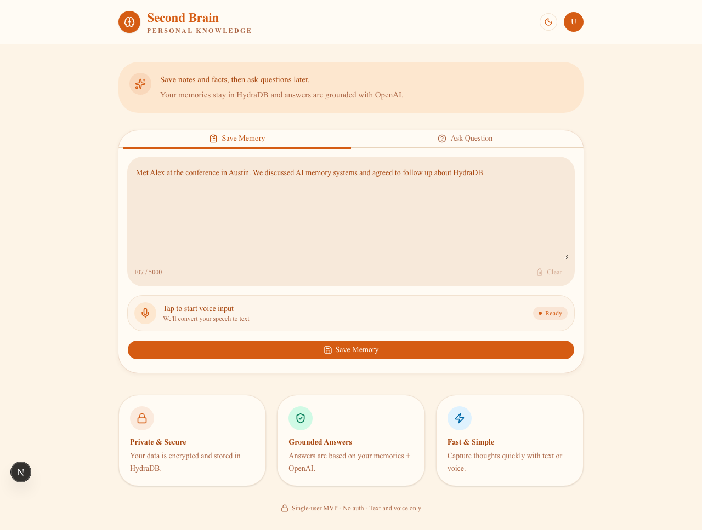
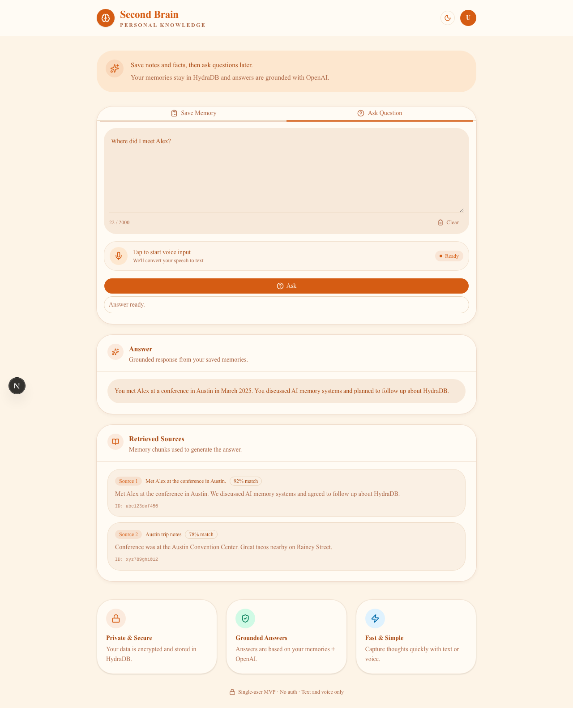
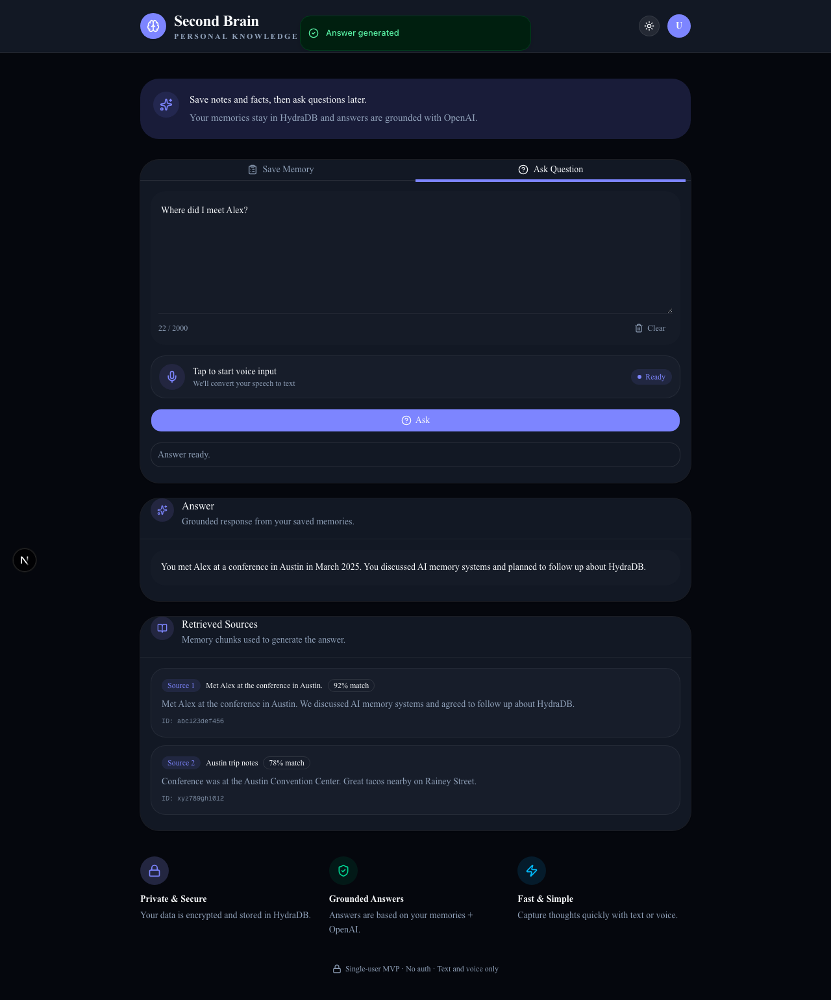
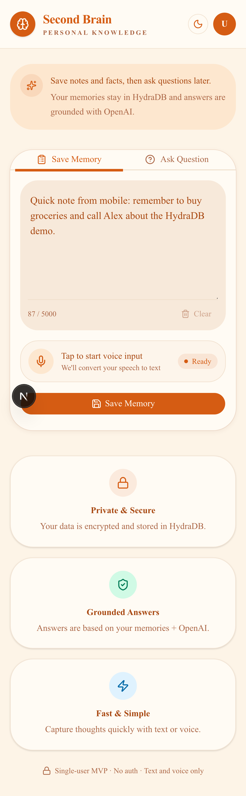
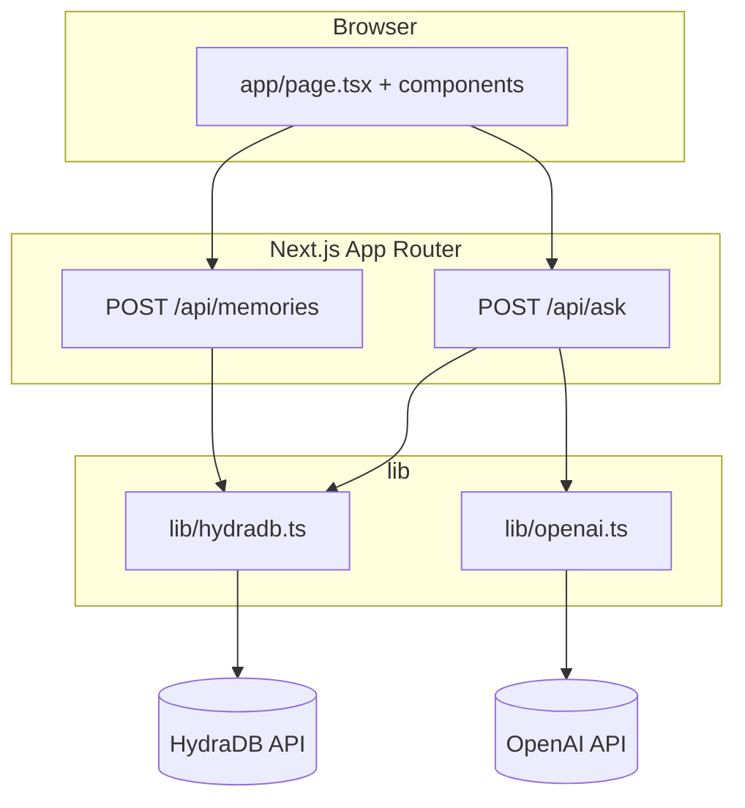

# Second Brain

**Live:** [https://second-brain-blue-eight.vercel.app/](https://second-brain-blue-eight.vercel.app/)

**Second Brain** is the product name; this repo is **`cursorers`**. A single-user MVP web app for capturing personal memories (text or voice) and asking grounded questions later. Memories are stored and retrieved with [HydraDB](https://docs.hydradb.com/), and answers are generated with the OpenAI API.

## Why not just another chatbot?

Most hackathon memory apps stack LangChain, Pinecone, and a generic chat UI. Second Brain takes a narrower, production-shaped path:

- **HydraDB-native** — memories go straight through `@hydradb/sdk` (`addMemory`, `verifyProcessing`, recall). No vector-store boilerplate or agent framework in the middle.
- **Capture-first UX** — Save and Ask are separate modes with voice input, not a single endless chat thread.
- **Grounded, cited answers** — OpenAI answers only from recalled chunks; the UI shows source IDs, titles, and relevancy scores.
- **Indexing-aware save** — the server polls HydraDB until memories are searchable, instead of fire-and-forget uploads.

It is still an MVP (single shared namespace, no auth), but the architecture is built around durable memory ingestion and retrieval—not a thin wrapper on ChatGPT.

## Demo script (30 seconds)

Try the [live app](https://second-brain-blue-eight.vercel.app/) or run locally with your API keys:

1. Open the **Save Memory** tab.
2. Paste: `Met Alex at the conference in Austin in March 2025. We discussed AI memory systems and planned to follow up about HydraDB.`
3. Click **Save Memory** and wait for the success toast (indexing may take a few seconds).
4. Switch to **Ask Question**.
5. Ask: `Where did I meet Alex?`
6. Confirm the answer references Austin and that **Retrieved Sources** lists matching memory chunks with scores.

If recall is empty right after save, wait ~10 seconds and ask again—HydraDB indexing can lag briefly on new memories.

## Screenshots

**Save Memory** — capture notes via text or voice.



**Ask Question** — grounded answers with cited memory chunks from HydraDB.



**Dark mode** — theme toggle via next-themes.



**Mobile** — responsive layout on a phone viewport.



Regenerate with `npm run dev` running, then `npm run screenshots`.

## Stack

**Next.js 16** · **React 19** · **TypeScript 5** · **Tailwind CSS 4**

- **Next.js** (App Router) + **React** + **TypeScript**
- **Tailwind CSS** + **shadcn/ui**
- **sonner** — toast notifications
- **next-themes** — light/dark theme
- **lucide-react** — icons
- **HydraDB** (`@hydradb/sdk`) for memory storage and semantic recall
- **OpenAI** (`gpt-4o-mini`) for grounded answer generation
- **Web Speech API** for browser voice input
- **Zod** for request validation

## Architecture

The app is a single-page UI that talks to two Next.js Route Handlers. API keys stay on the server in `lib/*`; there is no database in this repo—HydraDB holds all memories.

**Save flow**

1. Browser → `POST /api/memories`
2. `saveMemory()` calls HydraDB `upload.addMemory` with `sub_tenant_id: "mvp_user"` and `infer: false`
3. The server polls `upload.verifyProcessing` for up to ~12 seconds until indexing reaches a ready status (`completed`, `graph_creation`, or `success`)
4. Response: `{ sourceId, status, message }`

**Ask flow**

1. Browser → `POST /api/ask`
2. `searchMemories()` calls HydraDB `recall.recallPreferences` (`max_results: 6`, `mode: "fast"`)
3. `generateGroundedAnswer()` sends recalled chunks to OpenAI `gpt-4o-mini` (temperature `0.2`) with a system prompt that answers only from those memories
4. Response: `{ answer, sources }`

**Design constraints**

- Secrets only on the server (Route Handlers + `lib/*`)
- No in-repo database; HydraDB is the memory store
- Single hardcoded sub-tenant `mvp_user` for all MVP memories



## Project layout

| Path | Role |
| --- | --- |
| `app/page.tsx` | Home UI (save / ask tabs) |
| `app/api/memories/route.ts` | Save endpoint |
| `app/api/ask/route.ts` | Ask endpoint |
| `lib/hydradb.ts` | HydraDB client, save, recall, indexing poll |
| `lib/openai.ts` | Grounded answer generation |
| `lib/validation.ts` | Zod schemas (5000 / 2000 char limits) |
| `components/` | UI (voice input, result panel, shadcn primitives) |

## Features

- **Save** and **Ask** tabs on one page
- Text input with character limits (5000 for save, 2000 for ask)
- **Voice input** via the Web Speech API (`components/voice-input.tsx`)
- **Ask** shows the generated answer plus cited memory chunks (`components/result-panel.tsx`)
- Light/dark theme toggle (`components/theme-toggle.tsx`)
- Toast feedback via sonner

## Prerequisites

- **Node.js** 20+
- **npm** (or a compatible package manager)
- A [HydraDB](https://app.hydradb.com) account and an OpenAI API key

## Environment variables

Create a `.env.local` file (see `.env.example`):

| Variable | Description |
| --- | --- |
| `OPENAI_API_KEY` | OpenAI API key for answer generation |
| `HYDRADB_API_KEY` | HydraDB API key from [app.hydradb.com](https://app.hydradb.com) |
| `HYDRADB_PROJECT_ID` | HydraDB `tenant_id` for your workspace |
| `HYDRADB_URL` | Optional custom API base URL (defaults to `https://api.hydradb.com`) |

## HydraDB setup

1. Sign up or log in at [app.hydradb.com](https://app.hydradb.com).
2. Create or open a project/workspace.
3. Copy the **tenant ID** into `HYDRADB_PROJECT_ID`.
4. Create an API key and set `HYDRADB_API_KEY`.
5. (Optional) Set `HYDRADB_URL` if you are not using the default `https://api.hydradb.com`.

All MVP memories are stored under the fixed sub-tenant `mvp_user`.

## How to run locally

1. Install dependencies:

```bash
npm install
```

2. Copy environment variables and fill in your keys:

```bash
cp .env.example .env.local
```

3. Complete [HydraDB setup](#hydradb-setup) so `HYDRADB_PROJECT_ID` matches your tenant ID.

4. Start the dev server:

```bash
npm run dev
```

5. Open [http://localhost:3000](http://localhost:3000).

### Scripts

| Command | Purpose |
| --- | --- |
| `npm run dev` | Development server |
| `npm run build` | Production build |
| `npm run start` | Run production build |
| `npm run lint` | ESLint |
| `npm run screenshots` | Capture README screenshots with Playwright (dev server must be running) |

## API

Validation limits (enforced in `lib/validation.ts`):

- **Save**: `content` — 1–5000 characters
- **Ask**: `question` — 1–2000 characters

Errors return `{ "error": "message" }` with status `400` (validation) or `500` (server).

### `POST /api/memories`

Saves a memory to HydraDB and waits briefly for indexing. Hashtags in `content` (e.g. `#conference`) are extracted into `additional_metadata.tags` and stripped from the stored text. Each memory gets `additional_metadata.created_at` (ISO-8601 UTC) at save time.

**Request**

```bash
curl -X POST http://localhost:3000/api/memories \
  -H "Content-Type: application/json" \
  -d '{"content": "Met Alex in Austin #conference #networking"}'
```

Stored text: `Met Alex in Austin`. Metadata tags: `conference`, `networking`.

**Success (200)**

```json
{
  "sourceId": "abc123",
  "status": "completed",
  "message": "Memory saved with tags: conference, networking",
  "tags": ["conference", "networking"]
}
```

**Validation error (400)**

```json
{ "error": "Memory content cannot be empty" }
```

### `POST /api/ask`

Recalls relevant memories and returns a grounded answer.

**Request**

```bash
curl -X POST http://localhost:3000/api/ask \
  -H "Content-Type: application/json" \
  -d '{"question": "Where did I meet Alex?"}'
```

**Success (200)**

```json
{
  "answer": "You met Alex at a conference in Austin.",
  "sources": [
    {
      "sourceId": "abc123",
      "title": "Met Alex at the conference in Austin.",
      "content": "Met Alex at the conference in Austin.",
      "score": 0.92
    }
  ]
}
```

**Validation error (400)**

```json
{ "error": "Question cannot be empty" }
```

## How to deploy to Vercel

1. Push this repository to GitHub.
2. Import the project in [Vercel](https://vercel.com).
3. Add the environment variables from `.env.example` in the Vercel project settings.
4. Deploy. No extra services are required for this MVP.
5. **Public deploy warning**: there is no authentication. Do not expose a production URL unless you accept that anyone can read and write the shared `mvp_user` namespace—or add auth first.

## Current limitations

- **No authentication** — anyone with the URL can use the app
- **Single shared namespace** — all memories use sub-tenant `mvp_user` (see [Architecture](#architecture))
- **Indexing delay** — save polls HydraDB briefly; recall may lag a few seconds for brand-new memories
- **Voice input** — depends on browser support (Chrome/Edge work best; Safari support varies)
- **No memory list/edit/delete UI** — only save and ask flows
- **No file upload, PostgreSQL, Redis, or background jobs**

## Future improvements

- User accounts and per-user sub-tenants
- Memory list, search, edit, and delete
- Longer ingestion polling or status UI after save
- Streaming answers from OpenAI
- `infer: true` for richer memory extraction on conversational notes
- Export/import of memories
- Mobile-optimized voice UX
